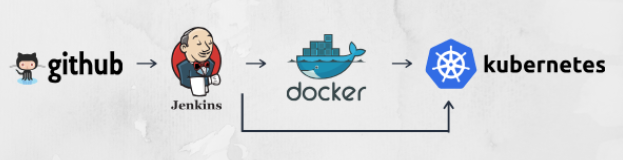
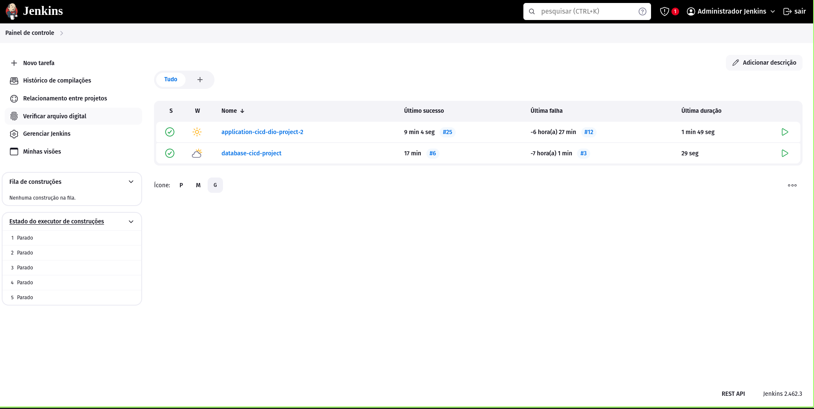
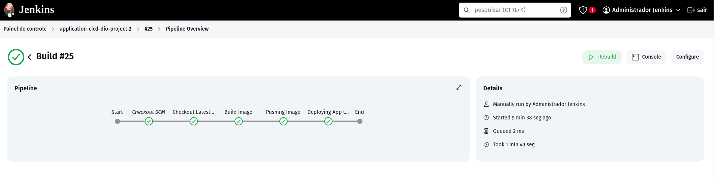
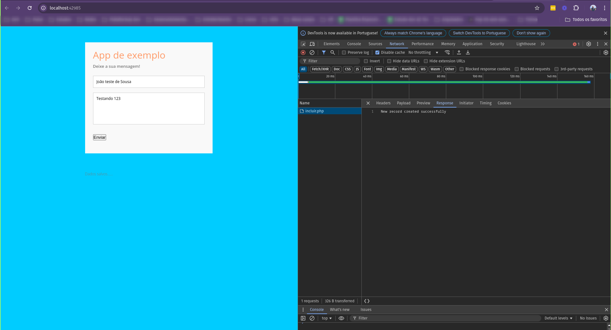
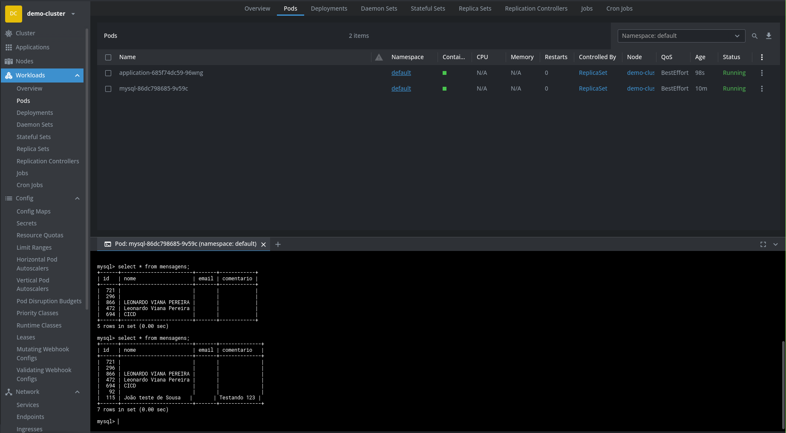

<h1 align="center">Pipeline simples - Automação de build e deploy com Jenkins e Kubernetes</h1>

  
  

  

## Projeto

Desenvolvimeto de uma estrutura simples de CICD com o seguintes steps:
- Checkout repository
- Docker build
- Docker push 
- Deployment Cluster K8S

Tecnologias:
- Git
- Github
- Cluster Kubernetes com minikube
- Kubectl
- Jenkins
- Javascript
- Html
- PHP
- Mysql
- Docker

## Etapas do projeto

- [x] [Criação de um cluster com minikube](./docs/criacao-cluster.md)
- [x] [Setup Jenkins](./docs/setup-jenkins.md)
- [x] [Aplicações](./app/Readme.md)
- [x] [Pipeline - Steps CI/CD](./app/application/Jenkinsfile)
- [x] [Teste de integração Jenkins x Kubernetes](./infra/cicd/test-connection-k8s.groovy)

## Serviço rodando

- Criação dos JObs

  

- Execução do Jobs

  

- Acessando a aplicação e enviando formulário

  

- Checando as informações no banco de dados

  

