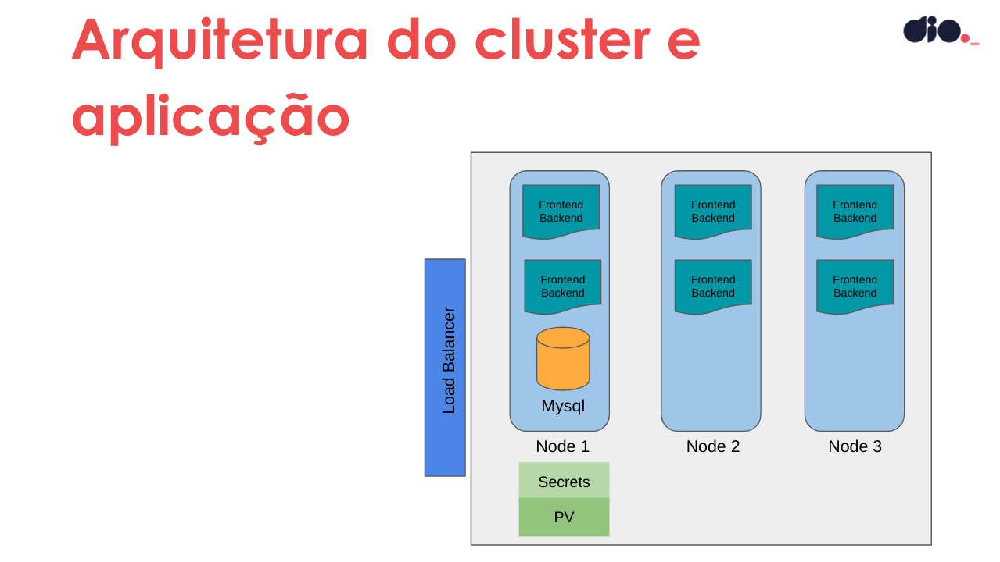

## Services

Banco de Dados

- Para persistência de dados será utilizando um Banco de Ddos Mysql

Aplicação

- APlicação desenvolvida em `PHP`, `Java Script`, `HTML` e `CSS`.

## Arquitetura

- Arquitetura do cluster e aplicação

  

