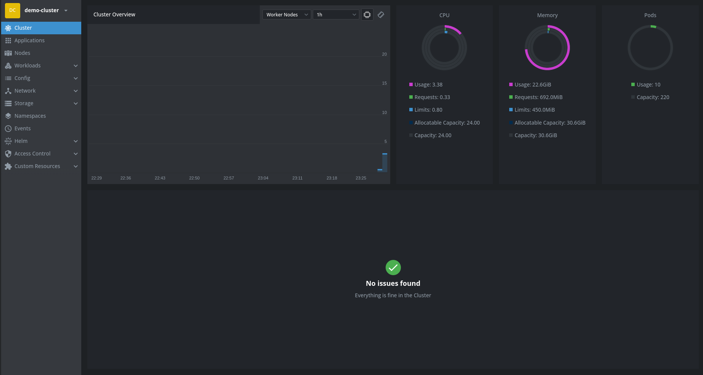

## Criação Cluster Minikube

Os comando para criação do cluster foram registrado [aqui](../infra/k8s/cluster-create.sh)

Foi utilizado o [Lens](https://k8slens.dev/) como dashboard para uma melhor interação e visualização do cluster.

  

  

