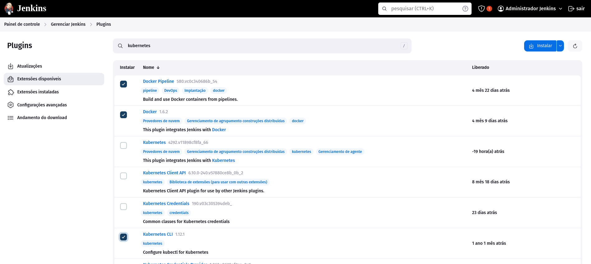
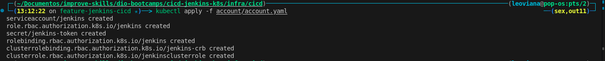
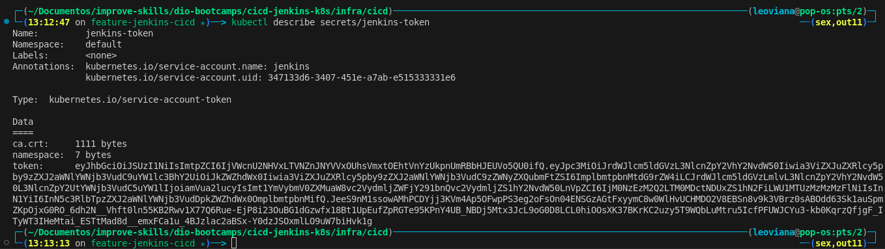
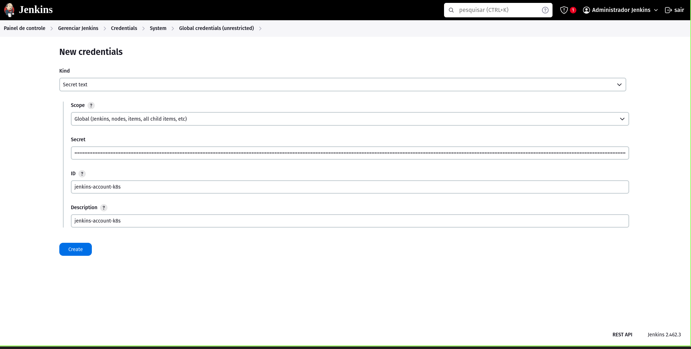
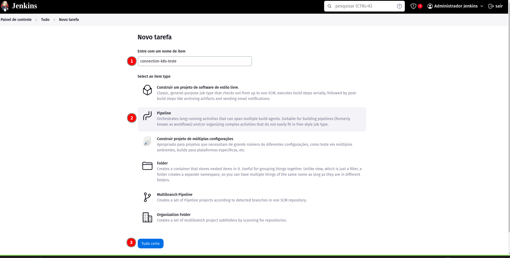
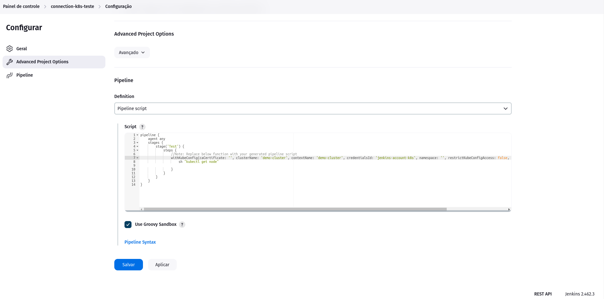
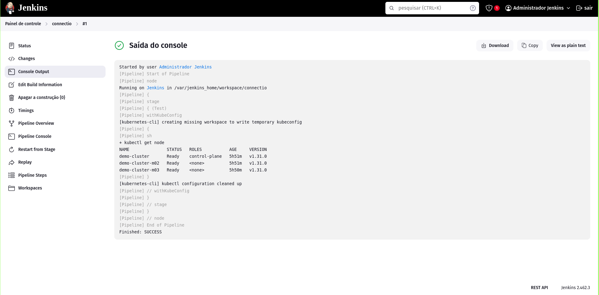

## Setup Jenkins

Para o Setup Jenkins foi utilizado alguns arquivos de configuração:

- [Dockerfile](../infra/cicd/Dockerfile)
- [Docker compos](../infra/cicd/docker-compose.yml)
- [Plugins](../infra/cicd/plugins.txt)
- [Criação de Service Account e Roles no Cluster Kubernetes](../infra/cicd/account/account.yaml)

## Plugins Jenkins

  

## Jenkins Service Account

- Criando Service account

  

- Pegar o token

  

- Criar uma credencial no Jenkins

  

## PIpeline para teste de conexão Jenkins x K8S

- Criar o job

  

- Criar Pipeline

  

- Execução job

  

